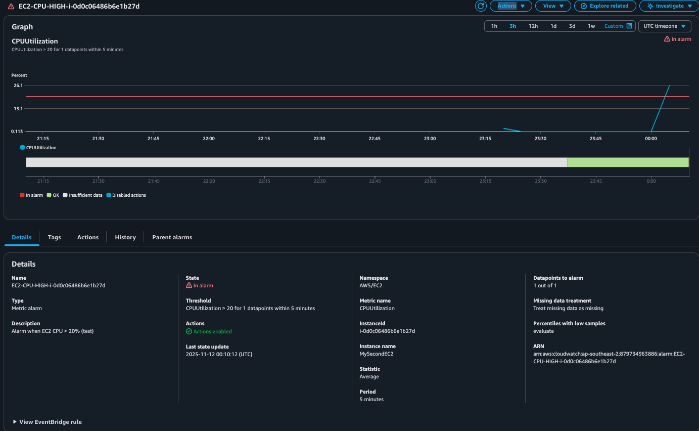
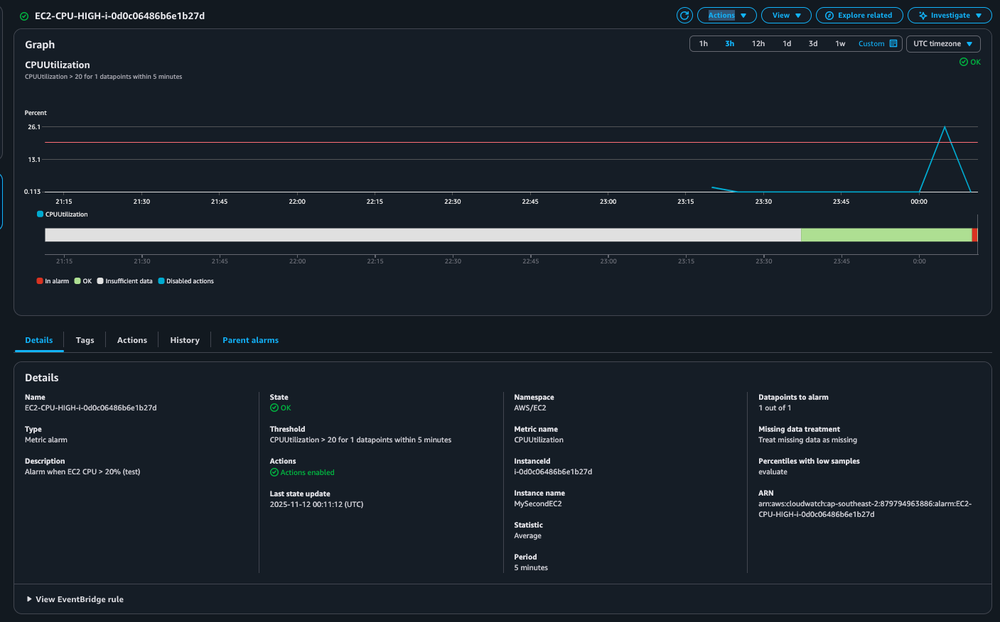

# 🧠 Day 14 – CloudWatch Monitoring & Linux Essentials  

## 🎯 Goals  
- Learn essential Linux commands for system health and troubleshooting.  
- Configure **Amazon CloudWatch** to monitor CPU utilization.  
- Create and test a **CloudWatch Alarm** to detect abnormal CPU load.  

---

## 🧩 Part 1 – Linux Essentials  

Below are some commonly used commands for checking system performance and troubleshooting within an EC2 instance:

| Command | Description | Example Output |
|----------|--------------|----------------|
| `uname -a` | Show full system info (kernel, architecture) | Linux version info |
| `uptime` | Display uptime and system load average | 1:00 up 2 days, load average: 0.02 |
| `top` | View real-time CPU/memory usage (press `q` to quit) | CPU% and memory list |
| `df -h` | Show disk usage in human-readable format | Filesystem %Use Mounted on |
| `free -m` | Display memory usage in MB | Total / Used / Free RAM |
| `ping google.com` | Test network connectivity | PING response times |
| `journalctl -n 20` | Show last 20 system log entries | Latest system logs |
| `grep error /var/log/messages` | Search for errors in system log | Lines containing “error” |

💡 *These commands are core tools for diagnosing performance issues in Cloud or DevOps environments.*

---

## ☁️ Part 2 – CloudWatch Monitoring  

### Step 1. Verify the CloudWatch Agent  
Check if the agent is running:  
```bash
sudo systemctl status amazon-cloudwatch-agent
```
If not installed, run:
```
sudo yum install amazon-cloudwatch-agent -y
sudo systemctl start amazon-cloudwatch-agent
sudo systemctl enable amazon-cloudwatch-agent
```

### Step 2. Create a CPU Utilization Alarm
1. Go to AWS Console → CloudWatch → Alarms → Create alarm
2. Choose:
Metric: EC2 → Per-Instance Metrics → CPUUtilization
3. Select your EC2 instance ID
4. Set the condition:
```
CPUUtilization > 20% for 1 datapoint within 5 minutes
```
5. Optional: add an SNS topic for notifications
6. Create the alarm

### Step 3. Trigger the Alarm (CPU Stress Test)

Install and run stress to simulate load:
```
sudo yum install stress -y
stress --cpu 2 --timeout 60
```
This command uses 2 CPU cores for 60 seconds.
After a few minutes, CloudWatch will register higher CPU usage.

### 📸 Screenshots:

**Step 1 – Alarm Created**


**Step 2 – Alarm Triggered**


**Step 3 – Alarm Recovered (Optional)**


### 🧾 Summary
✅ Learned to use essential Linux commands for real-time system monitoring.
✅ Installed and verified the CloudWatch agent.
✅ Created a CPUUtilization alarm with a 20% threshold.
✅ Successfully tested alarm transitions from OK → ALARM → OK.
