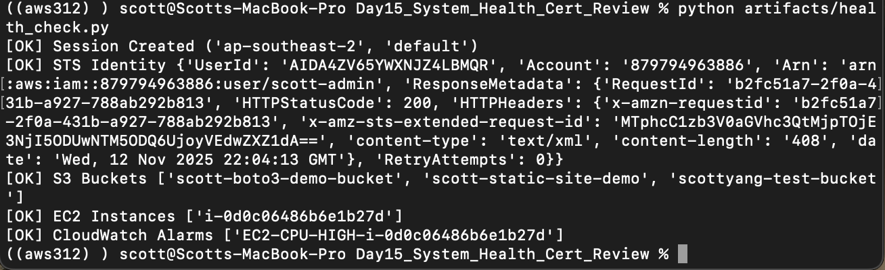
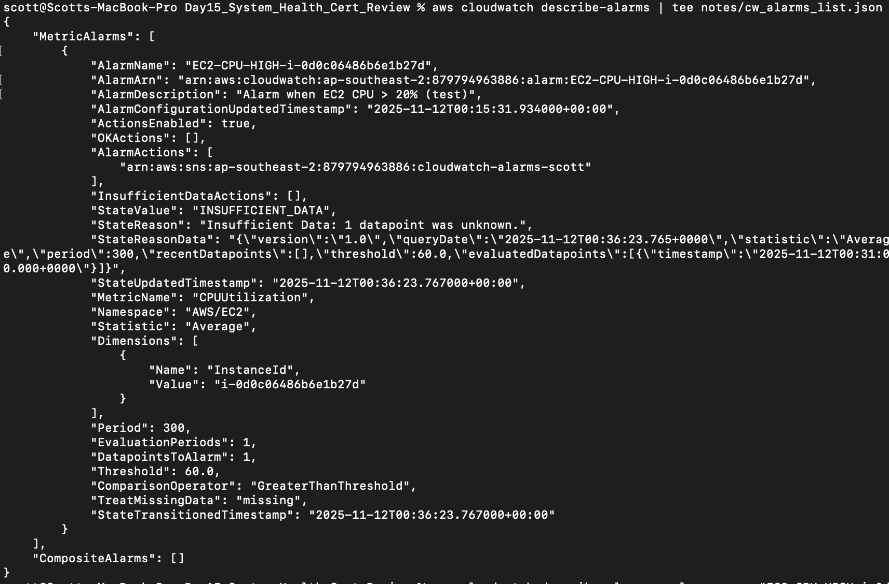
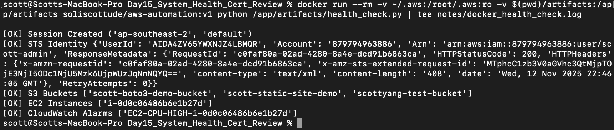
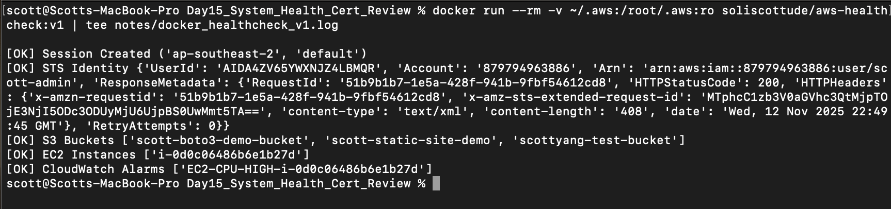

# 🧠 Day 15 – System Health + Certification Review

## 🎯 Goals
- Integrate previous tools: **boto3 scripts**, **Docker container**, and **CloudWatch alarms**  
- Review and verify all AWS connections in one environment  
- Create a dedicated Docker image for **system health checks**  

---

## 🧩 Step 1 – Health Check Script
- Created a `health_check.py` script using `boto3.session.Session()`  
- Verified AWS services connection:  
  - ✅ **STS** identity  
  - ✅ **S3** bucket listing  
  - ✅ **EC2** instance state  
  - ✅ **CloudWatch** alarms  

📁 File path: `Day15_System_Health_Cert_Review/artifacts/health_check.py`  
📄 Output saved in: `notes/health_check.log`  
📸 Screenshot: 

---

## 🧩 Step 2 – CloudWatch Alarm Verification
- Checked existing CPU Utilization alarm for EC2 instance  
- Verified alarm configuration via AWS CLI  
- Captured CloudWatch console screenshot  

📄 CLI output: `notes/cw_alarms_list.json`  
📸 Screenshots:  
  -   
  - 

---

## 🧩 Step 3 – Docker Integration (Health Check)
- Tested running the health check script inside Docker container  
- Used local AWS credentials and script volume mounts  

```bash
docker run --rm -v ~/.aws:/root/.aws:ro -v $(pwd)/artifacts:/app/artifacts soliscottude/aws-automation:v1 python /app/artifacts/health_check.py
```

📄 Output log: notes/docker_health_check.log
📸 Screenshot: 

## 🧩 Step 4 – Build and Upload New Docker Image
- Created a new lightweight image for system health checks
- Built independently under Day15 folder (no Day12 changes)

# Dockerfile
```
FROM python:3.12-slim
WORKDIR /app
COPY ./artifacts/health_check.py .
RUN pip install boto3
CMD ["python", "health_check.py"]
```

# Build & Push
```
docker build -t soliscottude/aws-healthcheck:v1 .
docker push soliscottude/aws-healthcheck:v1
```

📦 Docker Hub: soliscottude/aws-healthcheck:v1
📸 Screenshot: 

## 🧩 **Step 5 – Final Summary**

### ✅ Tools Combined
| Tool | Purpose | Status |
|------|----------|--------|
| boto3 | AWS automation scripts | ✅ Working |
| Docker | Containerized automation | ✅ Verified |
| CloudWatch | Monitoring & alarms | ✅ Active |
| AWS CLI | Credential access & management | ✅ Passed |

---

### 🧱 Docker Images Overview
| Image | Description | Status |
|-------|--------------|--------|
| `soliscottude/aws-automation:v1` | Day 12 – Full AWS Automation Manager | ✅ Verified |
| `soliscottude/aws-healthcheck:v1` | Day 15 – System Health Check (lightweight image) | ✅ Uploaded |

---

## 🧭 **Summary**
Day 15 concludes the **System Health & Certification Review** module.  
All components — **boto3**, **Docker**, and **CloudWatch** — were verified successfully and integrated in a unified workflow.  
This marks the completion of the technical section of the learning journey.  
Next up ➡️ **Day 16 – Mock Interview & Portfolio Completion.**

---

## 📁 **Folder Structure**
```
Day15_System_Health_Cert_Review/
│
├── artifacts/
│ └── health_check.py
│
├── notes/
│ ├── health_check.log
│ ├── cw_alarms_list.json
│ ├── cw_alarm_target.json
│ ├── docker_run.log
│ ├── docker_health_check.log
│ └── docker_healthcheck_v1.log
│
├── screenshots/
│ ├── Day15_health_check.png
│ ├── Day15_alarm_cli.png
│ ├── Day15_alarm.png
│ ├── Day15_docker_healthcheck.png
│ └── Day15_docker_healthcheck_v1.png
│
└── README.md
```