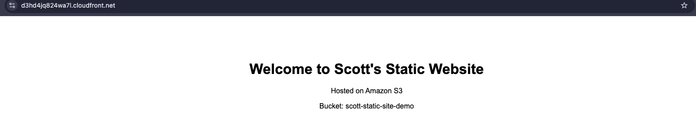
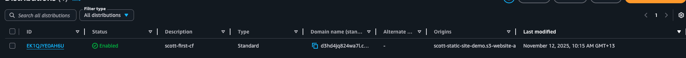

# 🌐 Day 6 – CloudFront + Route 53 (Optional)

## 🎯 Goal
Use Amazon CloudFront to speed up access to the S3 static website from Day 5.  

---

## 🧩 Steps
1. Open **CloudFront Console** → **Create Distribution**
2. Choose **Origin domain**: `scott-static-site-demo.s3-website-ap-southeast-2.amazonaws.com`
3. Viewer protocol policy: **Redirect HTTP to HTTPS**
4. Disable security protections to avoid extra WAF costs
5. Keep recommended cache settings
6. Wait for the status to become **Deployed**
7. Test access using CloudFront domain (e.g. `d3hd4jq824wa7l.cloudfront.net`)

---

## ✅ Verification
- Website loads successfully from CloudFront URL  
- HTTPS enabled by default  
- Confirmed faster response than direct S3 link  

---

## 💡 Notes
- Route 53 domain purchase is optional (paid feature).  
- WAF “security protections” disabled to stay within free tier.  
- CloudFront automatically caches static website content globally.

---

## 📸 Screenshot

